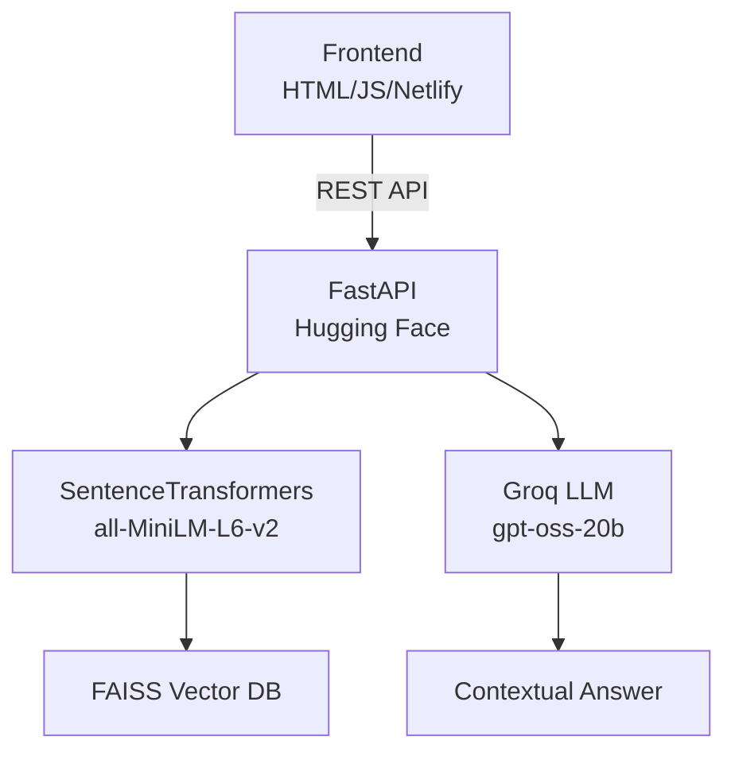

#  AI NoteBook Assistant (RAG) – GitHub Repo  

**Turn any PDF into your personal AI tutor.**  
Full-stack Retrieval-Augmented Generation system built with speed and simplicity in mind.  

[](https://ai-notebook-rag.netlify.app)  
[](https://gvadxx-ai-notebook-assistant-rag.hf.space/docs)  
[](https://github.com/gvadxx/AI-NoteBook-Assistant-RAG)

---

##  Features  

- ✅ Upload PDFs → auto-chunked & embedded  
- ✅ Semantic search with **FAISS**  
- ✅ Lightning-fast answers via **Groq (gpt-oss-20b)**  
- ✅ Clean REST API + beautiful vanilla JS frontend  
- ✅ Zero-cost deploy: **Hugging Face Spaces** + **Netlify**  

---

##  Architecture  



---

##  Local Development (5 minutes)

```bash
# 1. Clone
git clone https://github.com/gvadxx/AI-NoteBook-Assistant-RAG.git
cd AI-NoteBook-Assistant-RAG

# 2. Virtual environment
python -m venv venv
source venv/bin/activate    # Windows: venv\Scripts\activate

# 3. Install dependencies
pip install -r app/requirements.txt

# 4. Run backend
uvicorn app.main:app --reload
```

→ Swagger UI: [https://gvadxx-ai-notebook-assistant-rag.hf.space/docs](https://gvadxx-ai-notebook-assistant-rag.hf.space/docs)

### Frontend (local preview)

```bash
cd frontend
npx serve .   # or: python -m http.server 3000
```

Update `script.js`:
```js
const backendURL = "http://127.0.0.1:8000";
```

---

## ☁ Deploy in 2 clicks  

### Backend → Hugging Face Spaces  
1. Fork this repo  
2. Go to [hf.co/new](https://huggingface.co/new) → Connect repo → **Docker** template → Create  

**Dockerfile (already included)**  
```dockerfile
FROM python:3.10-slim
WORKDIR /code
RUN apt-get update && apt-get install -y build-essential git \
    && rm -rf /var/lib/apt/lists/*
COPY app/requirements.txt .
RUN pip install --no-cache-dir -r requirements.txt
COPY app /code/app
EXPOSE 7860
CMD ["uvicorn", "app.main:app", "--host", "0.0.0.0", "--port", "7860"]
```

### Frontend → Netlify  
```bash
cd frontend
# Drag & drop folder to netlify.com/drop
# OR connect GitHub repo → auto-deploy
```

Update backend URL in `script.js`:
```js
const backendURL = "https://your-space-name.hf.space";
```

---

## 📂 Project Structure  

```
AI-NoteBook-Assistant-RAG/
├── app/
│   ├── main.py          # FastAPI routes
│   ├── rag_engine.py    # Retrieval + generation logic
│   ├── vector_store.py  # FAISS handling
│   └── requirements.txt
├── frontend/
│   ├── index.html
│   ├── script.js
│   └── style.css
├── Dockerfile
└── README.md
```

---

##  Author  

**Govardhan Padmasali**  
B.Tech ECE – Embedded Systems & AI  
India  
[LinkedIn](https://linkedin.com/in/govardhan-padmasali) • [GitHub](https://github.com/gvadxx)  

> “Where hardware meets intelligence.”  

---

##  License  

MIT © 2025 Govardhan Padmasali  

---

 **If this helps you study smarter, give it a star!**  
Your star keeps the project alive and inspires more free tools.  

Happy learning!

